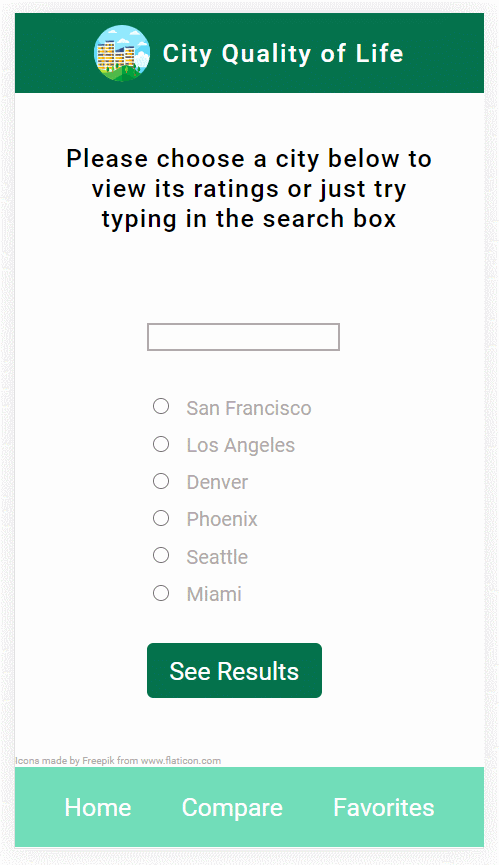

# City Quality of Life

A dynamic HTML, CSS, and JavaScript solo project.

Live Link: https://cbrisk.github.io/ajax-project/

## Technologies Used

- HTML5
- CSS3
- JavaScript

## Main Features of this App

* Users can view quality of life ratings for a couple of preselected cities
* Users can also enter any city they choose and see whether there is available data for that city
* Users can view ratings for available cities along with a summary
* Users can save cities in a favorites list and view that list
* Users can delete cities in the favorites list
* Users can compare the ratings of two cities (only select cities)
* Users can view the compared cities ratings with color coding on higher scores

## Preview



## Development


### Getting Started

1. Clone the repository.

    ```shell
    git clone https://github.com/cbrisk/ajax-project.git
    cd ajax-project
    ```

1. Install all dependencies with NPM.

    ```shell
    npm install
    ```
